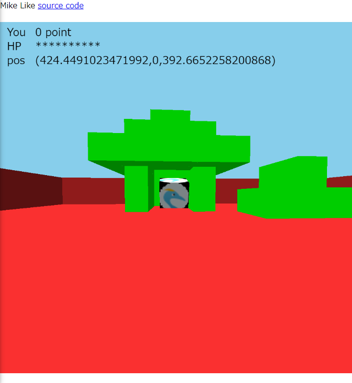

# Mike Like
Javascriptで実装された既視感のあるボクセルゲーム!

## 操作方法
|       ボタン | 操作                  |
| -----------: | :-------------------- |
|   左クリック | ブロック破壊&玉の発射 |
|   右クリック | ブロック設置&玉の発射 |
|        Wキー | 前に進む              |
|        Sキー | 後ろに進む            |
|        Aキー | 左に進む              |
|        Dキー | 右に進む              |
| スペースキー | ジャンプ              |
玉が打った人以外のプレーヤーに当たるとあたったプレーヤーの体力が1減り、その球を打ったプレイヤーの得点が1増えます。
簡易的な3Dシューティングゲームを楽しめますので、ぜひお楽しみください。

## インストール
事前にnpmをインストールしてください。
node v14.18.0, npm v6.14.15での動作を確認しております。
```
$ npm install
```

## サーバーの起動
```
$ node server.js [-p (ポート番号)]
```
もしくは、
```
$ nodemon server.js [-p (ポート番号)]
```
## ライセンス
[Paiza Battle Ground](https://github.com/yoshiokatsuneo/paiza-battle-ground)に基づいており、これのライセンスはMITライセンスです。なお、このリポジトリにもMITライセンスが適用されています。詳しくは、このファイルと同じフォルダにある[LICENSE.MIT](LICENSE.MIT)をご覧ください。
